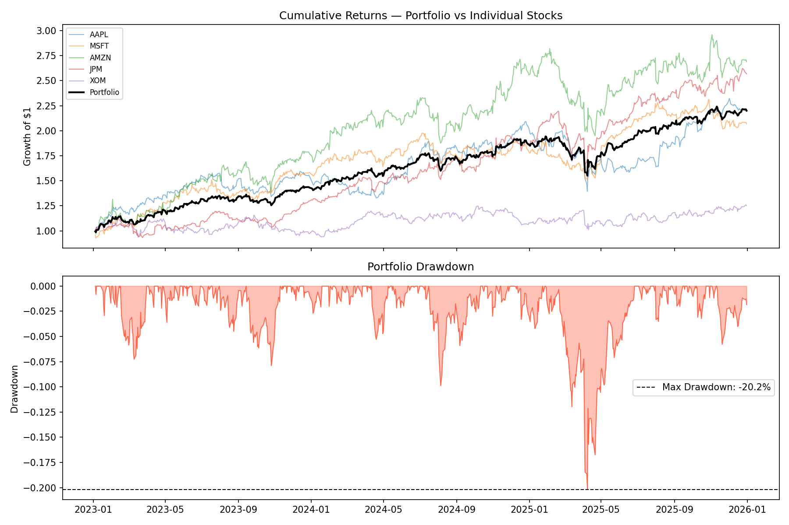
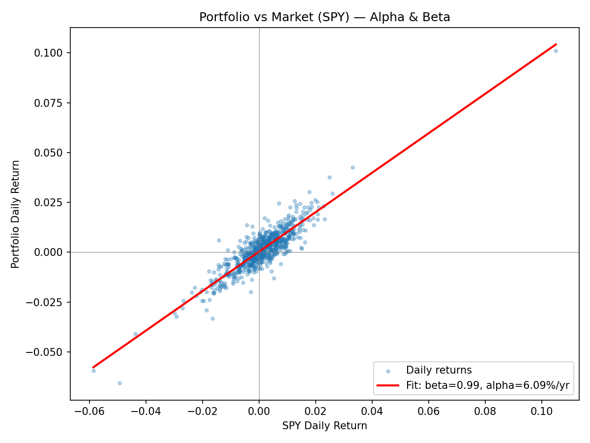

# Portfolio Risk & Return Analysis

Analysis of a 5-stock equally-weighted portfolio (AAPL, MSFT, AMZN, JPM, XOM)
over 2023–2026, covering returns, volatility, drawdown, and market exposure.

## Notebooks
1. `01_returns.ipynb` — daily & cumulative returns
2. `02_volatility_sharpe.ipynb` — annualized volatility, Sharpe ratio
3. `03_drawdown.ipynb` — maximum drawdown analysis
4. `04_alpha_beta.ipynb` — alpha/beta regression vs SPY
5. `05_report.ipynb` — summary report, all metrics + charts combined

## Key Results

| Metric | Portfolio |
|---|---|
| Annualized Return | 32.19% |
| Annualized Volatility | 17.05% |
| Sharpe Ratio | 1.89 |
| Max Drawdown | -20.18% |
| Beta (vs SPY) | 0.990 |
| Annualized Alpha | 6.09% |
| R-squared | 0.795 |

Portfolio Sharpe ratio (1.89) beat every individual holding, and max drawdown
(-20.18%) beat 4 of 5 individual stocks — demonstrating the core benefit of
diversification: a smoother, better risk-adjusted outcome than any single
stock offered alone.

## Tools
Python, pandas, NumPy, matplotlib, yfinance, scipy

## Data
Daily adjusted close prices, 2023-01-01 to 2026-01-01, via yfinance.